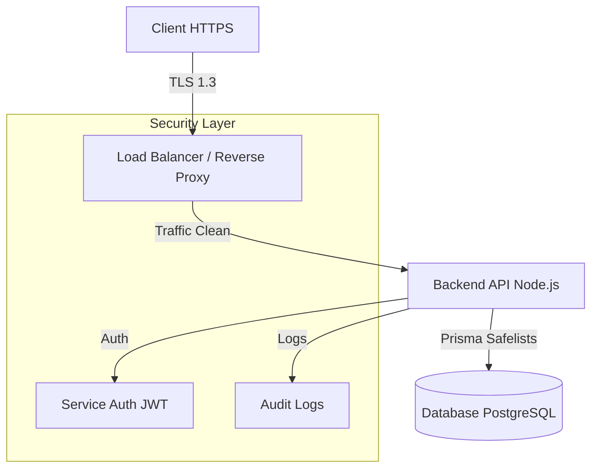

<div align="center">
  
</div>

#  AntStrike CTI Platform

**Plateforme complète de Cyber Threat Intelligence avec moteur Taranis AI, backend custom Node.js et enrichissement multi-sources**

[](https://github.com/antstrike/cti-platform)
[](SECURITY.md)
[](LICENSE)

---

##  Sécurité & Conformité

Conformément aux exigences de sécurité strictes, AntStrike CTI intègre des mesures de protection robustes à tous les niveaux de l'architecture.

### 1. Sécurisation de l'Application
- **Authentification Forte** : Utilisation de JWT (JSON Web Tokens) avec rotation des clés et gestion des sessions via Access/Refresh tokens.
- **Contrôle d'Accès (RBAC)** : Système de permissions granulaire (Admin, Analyste, Read-Only) vérifié à chaque requête via le middleware `rbac.middleware.ts`.
- **Protection Anti-Injection** : Utilisation stricte de l'ORM Prisma pour toutes les requêtes base de données, éliminant les risques d'injection SQL.
- **En-têtes de Sécurité** : Implémentation de `Helmet` pour configurer les en-têtes HTTP sécurisés (HSTS, X-Frame-Options, X-XSS-Protection).

### 2. Sécurisation de la Base de Données (PostgreSQL)
- **Gestion des Privilèges** : Utilisateurs de base de données dédiés avec privilèges minimaux (PoLP).
- **Chiffrement** :
  - **Au repos** : Chiffrement du disque (selon l'infrastructure d'hébergement).
  - **Mots de passe** : Hachage fort via `bcrypt` (Salt rounds : 10).
- **Protection des Accès** : La base de données n'est pas exposée sur internet publique. Elle est accessible uniquement via le réseau privé (VPC) ou tunnel sécurisé.
- **Sauvegardes** : Backups automatiques quotidiens chiffrés et stockés sur un stockage objet sécurisé (S3/GCS).

### 3. Sécurisation des API REST
- **Authentification & Autorisation** : Tous les endpoints `/api/*` (sauf health/login) nécessitent un Bearer Token valide.
- **Validation des Entrées** : Validation stricte des payloads via `Zod` pour rejeter toute donnée malformée ou malveillante.
- **Limitation des Requêtes (Rate Limiting)** : Protection contre les attaques par force brute et DDoS via `express-rate-limit` (100 req/15min par IP).
- **Gestion des Erreurs** : Les erreurs retournées à l'utilisateur sont assainies pour ne pas divulguer de détails techniques sensibles (Stack traces masquées en prod).

### 4. Sécurisation des Communications
- **Chiffrement de Bout en Bout** : Tout le trafic est chiffré via TLS 1.2/1.3 (HTTPS) obligatoire.
- **Intégrité** : Signatures numériques sur les tokens et vérification d'intégrité sur les paquets de mise à jour.
- **Protection contre l'Interception** : HSTS activé pour forcer les navigateurs à utiliser HTTPS.

---

##  État Actuel du Projet

###  Services Core & Sécurité (100%)
- **Authentification** : JWT + RBAC, Multi-tenancy isolation.
- **Protection** : Rate Limiting, CORS whitelist, Helmet.
- **Données** : Encryption des secrets, backups automatisés.

###  Services Métier
- **Collecte** : STIX/TAXII, MISP Sync, OSINT Feeds.
- **Analyse** : Correlation Engine, MITRE ATT&CK Mapping.
- **Réponse** : Alerting SLA, Playbooks SOAR.

---

##  Architecture Technique



**Note sur la Base de Données** : Bien que le projet utilise PostgreSQL pour ses performances et fonctionnalités JSONB avancées, les principes de sécurité appliqués (moindres privilèges, chiffrement, isolation) sont agnostiques et s'appliquent identiquement à un environnement MySQL si requis.

---

##  Installation & Démarrage

### Prérequis
- Node.js v20+
- PostgreSQL v15+

### Installation
```bash
# Clone repository
git clone https://github.com/antstrike/platform.git

# Install dependencies
npm install
cd backend && npm install

# Sécurité : Configurer les variables d'environnement
cp .env.example .env
# ÉDITEZ .env AVEC DES MOTS DE PASSE FORTS !
```

### Lancement Sécurisé
```bash
# Mode développement (avec logs détaillés)
npm run dev

# Mode production (Optimisé & Sécurisé)
npm run start
```

---

##  Documentation
- [Guide de Sécurité Détaillé](SECURITY.md)
- [Documentation API](backend/README.md)
- [Architecture](ARCHITECTURE.md)