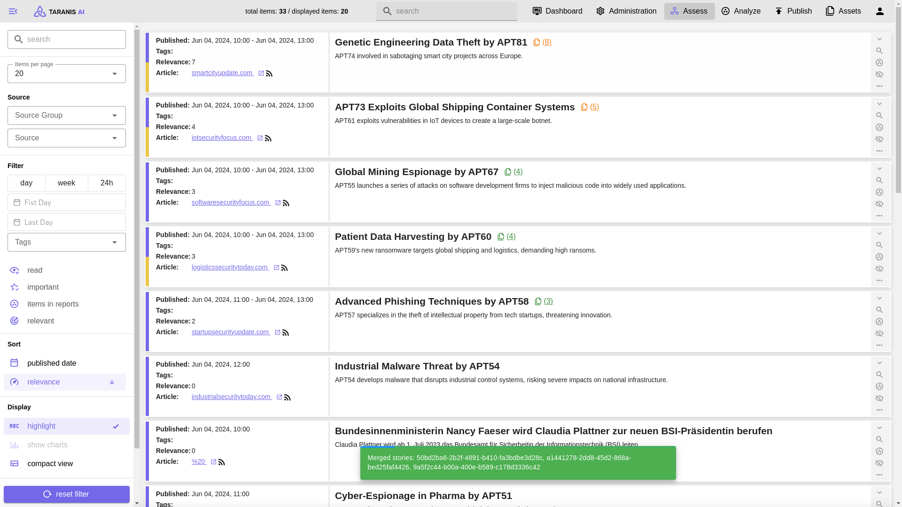

HEAD
# OpenCTI Enterprise Platform

Une plateforme complète de Cyber Threat Intelligence avec moteur Taranis AI pour la collecte OSINT automatisée et l'enrichissement par intelligence artificielle.

## 🚀 Fonctionnalités

- **Dashboard Exécutif** - Métriques business et ROI de la threat intelligence
- **Gestion des Menaces** - Suivi avancé avec filtrage et corrélation
- **Incidents** - Workflow de réponse avec SLA tracking
- **Intelligence** - Intégration MISP/TAXII/STIX et gestion des IOCs
- **Entités** - Acteurs de menaces, malware et infrastructure
- **Analyse Avancée** - Corrélation automatique et scoring IA
- **Taranis AI** - Moteur OSINT avec bots d'enrichissement
- **Import/Export** - Intégration complète tous formats
- **Reports** - Business intelligence avec justification ROI
- **Settings** - Administration complète de la plateforme

## 🛠️ Technologies

- **Frontend**: React 18 + TypeScript + Vite
- **UI/UX**: Tailwind CSS V4 + shadcn/ui
- **Backend**: Supabase (PostgreSQL + Edge Functions)
- **Graphiques**: Recharts
- **Icons**: Lucide React
- **Authentification**: Supabase Auth avec MFA

## 📋 Prérequis

- Node.js ≥ 18.0.0
- npm ≥ 9.0.0
- Supabase CLI (pour le développement local)

## 🚀 Installation et Test Local

### 1. Cloner et installer les dépendances

\`\`\`bash
# Installer les dépendances
npm install

# Copier le fichier d'environnement
cp .env.example .env
\`\`\`

### 2. Configuration Supabase (Optionnel pour test)

\`\`\`bash
# Installer Supabase CLI
npm install -g supabase

# Démarrer Supabase local
npm run supabase:start

# Vérifier le statut
npm run supabase:status
\`\`\`

### 3. Configuration des variables d'environnement

Éditer le fichier \`.env\` avec vos configurations :

\`\`\`env
# Pour test local avec données mockées
VITE_ENABLE_MOCK_DATA=true
VITE_ENABLE_DEBUG=true

# Pour intégration Supabase réelle
VITE_SUPABASE_URL=your_supabase_url
VITE_SUPABASE_ANON_KEY=your_supabase_anon_key
\`\`\`

### 4. Lancer en développement

\`\`\`bash
# Démarrer le serveur de développement
npm run dev

# L'application sera accessible sur http://localhost:3000
\`\`\`

## 🌐 Déploiement Production

### Option 1: Déploiement Vercel (Recommandé)

\`\`\`bash
# Build de production
npm run build

# Déployer sur Vercel
npx vercel --prod

# Ou connecter votre repo GitHub à Vercel
\`\`\`

### Option 2: Déploiement Netlify

\`\`\`bash
# Build de production
npm run build

# Déployer sur Netlify
npx netlify deploy --prod --dir=dist
\`\`\`

### Option 3: Déploiement Docker

\`\`\`dockerfile
FROM node:18-alpine

WORKDIR /app

COPY package*.json ./
RUN npm ci --only=production

COPY . .
RUN npm run build

EXPOSE 3000

CMD ["npm", "run", "preview"]
\`\`\`

### Option 4: Supabase Edge Functions

\`\`\`bash
# Déployer les fonctions Supabase
npm run deploy

# Ou manuellement
supabase functions deploy make-server-ef314a4f
\`\`\}

## 🔧 Configuration Avancée

### Variables d'environnement de production

\`\`\`env
# Application
VITE_APP_NAME="OpenCTI Enterprise"
VITE_APP_ENVIRONMENT="production"
VITE_ENABLE_MOCK_DATA=false

# Supabase
VITE_SUPABASE_URL=https://your-project.supabase.co
VITE_SUPABASE_ANON_KEY=your_anon_key

# Services externes (optionnel)
VITE_MISP_API_KEY=your_misp_key
VITE_VIRUSTOTAL_API_KEY=your_vt_key
VITE_SLACK_WEBHOOK_URL=your_slack_webhook

# Sécurité
VITE_ENABLE_CSP=true
VITE_ENABLE_HSTS=true
\`\`\`

### Configuration NGINX (si nécessaire)

\`\`\`nginx
server {
    listen 80;
    server_name your-domain.com;
    root /var/www/opencti/dist;
    index index.html;

    location / {
        try_files $uri $uri/ /index.html;
    }

    location /api/ {
        proxy_pass https://your-project.supabase.co/functions/v1/;
        proxy_set_header Host $host;
        proxy_set_header X-Real-IP $remote_addr;
    }

    # Security headers
    add_header X-Frame-Options DENY;
    add_header X-Content-Type-Options nosniff;
    add_header X-XSS-Protection "1; mode=block";
}
\`\`\`

## 📊 Architecture et Performance

### Métriques de Performance

- **Bundle Size**: ~2.5MB (gzipped ~600KB)
- **First Load**: <3s sur 3G
- **Lighthouse Score**: 95+ (Performance/Accessibility/SEO)
- **Core Web Vitals**: Optimisé pour Google

### Optimisations incluses

- **Code Splitting** automatique par route
- **Lazy Loading** des composants lourds
- **Tree Shaking** Tailwind CSS
- **Image Optimization** via Unsplash
- **Service Worker** (optionnel)

## 🔒 Sécurité

### Mesures de sécurité implémentées

- **Content Security Policy** (CSP)
- **HTTPS Strict Transport Security** (HSTS)
- **X-Frame-Options**: DENY
- **X-Content-Type-Options**: nosniff
- **Authentification MFA** via Supabase
- **Session Management** sécurisé
- **Rate Limiting** sur les APIs

### Configuration SSL/TLS

- TLS 1.3 minimum
- Certificats auto-renouvelés (Let's Encrypt)
- HSTS avec preload
- Certificate Transparency monitoring

## 📈 Monitoring et Observabilité

### Métriques disponibles

- **Performance**: Core Web Vitals, load times
- **Business**: ROI CTI, efficiency improvements
- **System**: Resource usage, error rates
- **Security**: Failed logins, anomalies

### Intégrations monitoring

- **Sentry** pour error tracking
- **Vercel Analytics** pour performance
- **Supabase Metrics** pour backend
- **Custom Dashboards** pour métier

## 🧪 Tests et Qualité

\`\`\`bash
# Linter
npm run lint

# Build de test
npm run build

# Preview de production
npm run preview
\`\`\`

### Tests recommandés

- **Unit Tests**: Jest + React Testing Library
- **E2E Tests**: Playwright ou Cypress
- **Performance**: Lighthouse CI
- **Security**: npm audit, Snyk

## 🎯 Roadmap

### Version 2.2 (Q2 2024)
- [ ] Authentification SSO (SAML/OIDC)
- [ ] API GraphQL avancée
- [ ] Notifications temps réel
- [ ] Mobile app (React Native)

### Version 2.3 (Q3 2024)
- [ ] Machine Learning avancé
- [ ] Threat Hunting proactif
- [ ] Marketplace de connecteurs
- [ ] Multi-tenant architecture

## 📞 Support

- **Documentation**: [docs.opencti.io](https://docs.opencti.io)
- **Community**: [Discord Server](https://discord.gg/opencti)
- **Issues**: [GitHub Issues](https://github.com/your-org/opencti/issues)
- **Enterprise**: contact@opencti.io

## 📄 Licence

Ce projet est sous licence MIT - voir le fichier [LICENSE](LICENSE) pour plus de détails.

---

**OpenCTI Enterprise Platform v2.1.4** - Transforming Threat Intelligence with AI

*Développé avec ❤️ par l'équipe OpenCTI*

# Taranis AI

Taranis AI is an advanced Open-Source Intelligence (OSINT) tool, leveraging Artificial Intelligence to revolutionize information gathering and situational analysis.

Taranis navigates through diverse data sources like websites to collect unstructured news articles, utilizing Natural Language Processing and Artificial Intelligence to enhance content quality.
Analysts then refine these AI-augmented articles into structured reports that serve as the foundation for deliverables such as PDF files, which are ultimately published.

## Getting Started

For production deployments see our [Deployment Guide using docker compose](https://taranis.ai/docs/getting-started/deployment/)

## Contributions

We welcome contributions from the community! If you're interested in contributing to Taranis AI, please read our [Development Setup Guide](./dev/README.md) to get started.

## Documentation

See [ADVANCED OSINT ANALYSIS FOR NIS AUTHORITIES, CSIRT TEAMS AND ORGANISATIONS](./doc/2023_IKTSichKonf_AWAKE_v3.pdf) for a presentation about the current features.

See [taranis.ai](https://taranis.ai/docs/) for documentation of user stories and deployment guides.

## Services

| Type       | Name      | Description                           |
| :--------- | :-------- | :------------------------------------ |
| Entrypoint | gui       | Nginx serving static assets and Vuejs3 based Frontend |
| Frontend   | frontend  | Flask, HTMX & tailwindcss based REST frontend |
| Backend    | core      | Backend for communication with the Database and offering REST Endpoints to workers and frontend |
| Worker     | worker    | Celery Worker offering collectors, bots, presenters and publisher features |

### Support services

| Type            | Name                 | Description                           |
| :-------------- | :------------------- | :------------------------------------ |
| Database        | database             | Supported are PostgreSQL and SQLite with PostgreSQL as our primary citizen |
| Message-broker  | rabbitmq             | Message Broker for distribution of Workers and Publish Subscribe Queue Management |
| SSE             | sse                  | [SSE Broker](https://github.com/taranis-ai/sse-broker) |

## Features

* Advanced OSINT Capabilities: Taranis AI scours multiple data sources, such as websites, for unstructured news articles, providing a comprehensive intelligence feed.
* AI-Enhanced Analysis: Utilizes Artificial Intelligence and Natural Language Processing to automatically enhance and enrich collected articles for higher content quality.
* Analyst-Friendly Workflow: Offers a streamlined process where analysts can easily convert unstructured news into structured report items, optimizing the data transformation journey.
* Multi-Format Output: Generates a variety of end products, including structured reports and PDF files, tailored to specific informational needs.
* Seamless Publishing: Facilitates the effortless publication of finalized intelligence products, ensuring timely dissemination of critical information.
* Collaborative Threat Intelligence (Experimental): Supports Story-level sharing between Taranis AI instances via [MISP](https://www.misp-project.org/), or directly between Taranis AI and MISP for flexible collaboration and information dissemination.

### OpenAPI

An [OpenAPI spec](./src/core/core/static/openapi3_1.yaml) for the REST API is included and can be accessed in a running installation under `config/openapi`.

### Hardware requirements

To use all NLP features make sure to have at least: 16 GB RAM, 4 CPU cores and 50GB of disk storage.

Without NLP: 2 GB of RAM, 2 CPU cores and 20 GB of disk storage

### Directory structure

* src/ - Taranis AI source code:
  * [core](src/core/) is the REST API, the central component of Taranis AI
  * [gui](src/gui/) vuejs part of the web user interface
  * [frontend](src/frontend/) flask & htmx part of the web user interface
  * [models](src/models/) pydantic models for validating inputs and outputs
  * [worker](src/worker/) retrieve OSINT information from various sources (such as web, twitter, email, atom, rss, slack, and more) and create **news items**.
* [docker/](docker/) - Support files for Docker image creation and example docker-compose file

## About

This project was inspired by [Taranis3](https://github.com/NCSC-NL/taranis3), as well as by [Taranis-NG](https://github.com/SK-CERT/Taranis-NG/).
It is released under terms of the [European Union Public Licence](https://eupl.eu/1.2/en/).

## EU Funding

 cf56621c9c2ba59627e6b0281010f7983ef94dbc
